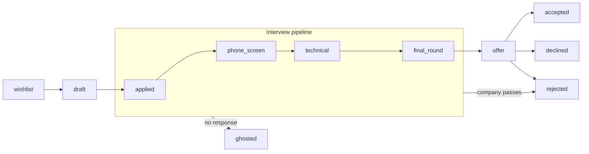

# Architecture

The technical brief: a guided tour of the seven decisions that carry most of this codebase, each section stating the choice, the reasoning, and the trade-off accepted — with file paths throughout, because the point of the file is that nothing in it asks to be taken on faith. The seven: a state machine in plain Ruby, the transactional write path behind every transition, ghost prediction derived from the audit trail, digest scheduling that defers and never drops, i18n parity as a CI check, one PostgreSQL instance for everything, and a JWT that never reaches the browser. [SPEC.md](SPEC.md) is the full technical spec; this file is the shorter read.

## The state machine is a plain Ruby module

[`api/app/lib/application_fsm.rb`](api/app/lib/application_fsm.rb) is the whole state machine: a frozen `TRANSITIONS` array of `{from:, to:}` pairs, a `TERMINAL_STATES` list, and two module methods, `assert_transition!` and `valid_next_states`. No AASM, no state_machines gem.

A gem buys callbacks, guards, and a DSL, and this domain needs none of them. The table fits in one file that reads top to bottom, and the one rule that is not a table row (any non-terminal state may move to `archived`) is a single guard clause in `assert_transition!`. The trade-off is losing the gem's event DSL, so side effects of a transition are written explicitly in the service layer, which is where this codebase wants them anyway.

Omitted from the diagram for readability: any non-terminal state can move to `archived`; the six pre-offer states (`wishlist` through `final_round`) can move to `withdrawn` (from `offer` the candidate-side exit is `declined`, not `withdrawn`); and `rejected`, `ghosted`, and `withdrawn` each revive to `applied`, because recruiters rescind rejections and ghosting companies sometimes come back. Only `accepted`, `declined`, and `archived` are hard terminal. Creation is separate from transition: a new application may start as `wishlist`, `draft`, or `applied` (`ENTRY_STATES`), and everything later is reachable only by transitioning, which keeps the audit trail honest.

The client never holds a copy of this table. `GET /api/v1/transitions` ([`api/app/controllers/api/v1/transitions_controller.rb`](api/app/controllers/api/v1/transitions_controller.rb)) serves the effective table, every state mapped through `valid_next_states` plus the entry, terminal, and active state lists. The board's drag targets and the detail page's transition buttons come from that response. The cost is one extra request; the server re-validates every transition regardless, so a stale client can offer a move badly but never authorize one.

## The write path of a transition

Every status change goes through [`api/app/services/applications/transition_service.rb`](api/app/services/applications/transition_service.rb). It asserts the transition first, then writes the status update and a `TimelineEntry` audit row inside one `ActiveRecord::Base.transaction`. No code path writes `status` directly, so the audit trail cannot miss an entry, and the ghost predictor below can treat it as complete.

Concurrency is optimistic. The transition endpoint ([`api/app/controllers/api/v1/applications_controller.rb`](api/app/controllers/api/v1/applications_controller.rb), `#transition`) assigns the client's `lock_version` before saving. A stale version raises `ActiveRecord::StaleObjectError`, rescued once in [`api/app/controllers/application_controller.rb`](api/app/controllers/application_controller.rb) as `409 Conflict` with code `stale_record`. The board applies a drag optimistically and snaps the card back when the response is `409` ([`web/app/[locale]/(app)/board/board.tsx`](web/app/%5Blocale%5D/%28app%29/board/board.tsx)).

The trade-off: the losing writer must reload and redo the edit. That beats the alternative, a silent last-write-wins when the same application is edited from two tabs.

## Ghost prediction is derived, not stored

[`api/app/queries/applications/ghost_risk_query.rb`](api/app/queries/applications/ghost_risk_query.rb) flags applications that have been quiet for longer than the user's own p90 reply time. It reconstructs how long each application sat in each stage from `timeline_entries` alone: `LAG(created_at) OVER (PARTITION BY application_id ORDER BY created_at)` finds each stage's entry moment, and `percentile_cont(0.9)` computes the per-stage p90. No new column, no new table; the audit rows the transition service already writes are the entire dataset.

Three guards exist because a p90 over four data points is a rumour, not a statistic. A stage needs at least 5 recorded replies before the personal threshold applies, the personal value is clamped to 7 to 90 days, and below the sample minimum a per-stage default takes over (21 days for `applied`, 14 for `phone_screen`), with the response naming which basis it used. Exits to `ghosted`, `withdrawn`, and `archived` are excluded from the sample; counting `ghosted` would let every ghosting the user records raise their own threshold until the predictor stopped predicting.

The trade-off: the query runs on each request instead of reading a precomputed flag. At the 200-applications-per-account cap that is cheap, and a derived answer can never disagree with the timeline it came from.

## Digest scheduling defers, never drops

One follow-up digest per user per day, never one email per application. The schedule is `15 8 * * * Asia/Tokyo` in [`api/config/recurring.yml`](api/config/recurring.yml), a Solid Queue recurring task; the queue supervisor runs inside Puma (`plugin :solid_queue` in [`api/config/puma.rb`](api/config/puma.rb)), so there is no worker service.

[`api/app/jobs/follow_up_reminder_job.rb`](api/app/jobs/follow_up_reminder_job.rb) first asks [`api/app/lib/japan_calendar.rb`](api/app/lib/japan_calendar.rb) whether a company would plausibly answer a nudge sent today, and holds if not. National holidays come from the `holidays` gem, because two of them move with the equinoxes and substitute holidays are a rule, not a date. New Year, Golden Week, and Obon are hardcoded spans on top, because they are not legal holidays and the gem does not know them; the question is whether anyone will reply, not whether the post office is open.

Held is not dropped. The due scope reaches 30 days back (`due_on_or_before`), so the next business day's run still sees everything that was held. Exactly-once delivery is a `TimelineEntry` with a unique `idempotency_key` derived from the application and its `follow_up_at`: whichever run inserts the row wins, a retried job cannot email twice, an unmoved overdue application is nudged once rather than every morning, and moving `follow_up_at` re-arms the reminder. The trade-off is that the guarantee rides on a unique index rather than on the scheduler, which is exactly why at-least-once delivery is safe here.

## i18n parity is a CI check, not a convention

The catalogs are [`web/messages/en.json`](web/messages/en.json) and [`web/messages/ja.json`](web/messages/ja.json) (next-intl, ICU messages). Routing uses `localePrefix: "as-needed"` in [`web/i18n/routing.ts`](web/i18n/routing.ts): Japanese is prefixed (`/ja/dashboard`), English keeps the bare path, and `/en/*` redirects to it, so each page has exactly one canonical URL. All navigation goes through the wrappers in [`web/i18n/navigation.ts`](web/i18n/navigation.ts), never `next/link` directly, because the originals silently drop the active locale.

[`web/i18n/request.ts`](web/i18n/request.ts) loads exactly one catalog and configures no fallback, so a missing Japanese key renders as the literal key path, `dashboard.yourData` where a sentence belongs. Nothing about that is a type error: lint, `tsc`, and the build all pass. [`web/scripts/check-i18n-parity.mjs`](web/scripts/check-i18n-parity.mjs) closes that gap in CI: it walks both catalogs, counting array elements as individual leaves and comparing container shapes, and fails on any path present in one language only. Its known limit: a key missing from both catalogs is symmetric and passes.

The trade-off: no English fallback means a missed key is loudly broken instead of quietly English. That is deliberate. A fallback would make a half-translated page look finished.

## One PostgreSQL instance, no Redis

Background jobs (Solid Queue), the cache and Rack::Attack throttle counters (Solid Cache), and uploaded PDFs (`bytea` columns with a 1 MB cap and magic-byte validation) all live in the primary PostgreSQL. One database means one backup, one connection string, one service to operate.

The trade-off is a set of deliberate ceilings. `bytea` instead of an object store only works because uploads are capped at 1 MB and 200 applications per account; a rate limit cannot bound total storage, because every window resets, so the hard cap does that job. Jobs inside Puma only work because the workload is small: the daily digest, an hourly cleanup, and an hourly reset of the shared demo account ([`api/app/jobs/demo_reset_job.rb`](api/app/jobs/demo_reset_job.rb)) back to its seed.

## The JWT never reaches the browser

Sign-in returns the JWT in a response header. A Next.js route handler ([`web/app/api/auth/session/route.ts`](web/app/api/auth/session/route.ts)) captures it and sets an `httpOnly` cookie, and every API call happens server-side through [`web/app/lib/api.ts`](web/app/lib/api.ts), so an XSS bug cannot exfiltrate the token. This is the main reason the frontend is Next.js rather than a pure client-side SPA: without a server layer, one would have to be built just to set that cookie.

Revocation is devise-jwt's `JTIMatcher` strategy: one `jti` column per user, rotated on sign-out, so every outstanding token dies together. The trade-off is a single session per user with 1-day expiry and no refresh flow; signing out anywhere signs you out everywhere, and re-authenticating is the only way back in. Route protection lives in [`web/proxy.ts`](web/proxy.ts) (Next.js 16 renamed `middleware.ts`), which also builds a per-request CSP nonce, so every page renders dynamically on purpose.
