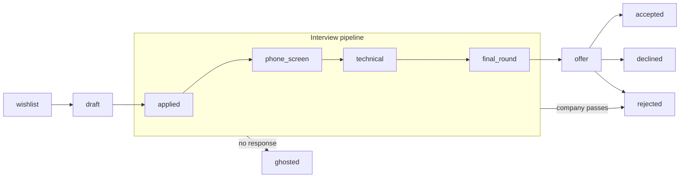

# Architecture

This file is a short technical overview of KarirKalyan. Its most important point: every claim in it can be checked directly in the code, because a file path is given next to almost every sentence. [SPEC.md](SPEC.md) is the full technical specification; this file is the shorter, simpler version. It covers eight decisions that shape most of the codebase, each one explained as a choice, the reason for it, and what was given up to make it: a state machine written in plain Ruby, one transaction that writes every status change, ghost-risk detection calculated from the audit log instead of stored separately, a reminder job that delays messages but never loses them, an automated check that keeps English and Japanese text in sync, one PostgreSQL database for the whole app, a JWT (JSON Web Token, a signed piece of text that proves who a user is) that never reaches the browser's JavaScript, and a move from Railway to self-hosted Docker and Cloudflare Tunnel.

## The state machine is a plain Ruby module

[`api/app/lib/application_fsm.rb`](api/app/lib/application_fsm.rb) is the whole state machine. A state machine is a set of rules for which status changes are allowed, for example moving an application from `applied` to `phone_screen`. The file has one frozen list of allowed moves (`TRANSITIONS`), one list of final states (`TERMINAL_STATES`), and two methods, `assert_transition!` and `valid_next_states`. There is no gem (a packaged Ruby library) such as AASM or `state_machines` here.

A gem like that would add callbacks, guards, and its own small language for describing events. This app does not need any of that. The whole rule list fits in one file that reads from top to bottom. The one rule that is not a row in that list, any non-final state can move to `archived`, is a single guard clause (a short check) inside `assert_transition!`. The trade-off is that side effects of a status change must be written by hand in the service layer instead of through the gem's event system. That fits how the rest of this codebase is already organized.

```mermaid
flowchart LR
    subgraph pipeline [Interview pipeline]
        direction LR
        applied --> phone_screen --> technical --> final_round
    end

    wishlist --> draft --> applied
    final_round --> offer

    offer --> accepted
    offer --> declined
    offer --> rejected
    pipeline -- company passes --> rejected
    pipeline -- no response --> ghosted
```

The diagram leaves out a few rules for clarity. Any non-final state can move to `archived`. The four pipeline states (`applied` through `final_round`) can move to `withdrawn`. From `offer`, the candidate's own way out is `declined`, not `withdrawn`, and before `applied` there is nothing yet to withdraw from, so an application dropped that early goes to `archived` instead. Also, `rejected`, `ghosted`, and `withdrawn` can each move back to `applied`, because a recruiter sometimes cancels a rejection, and a company that stopped answering sometimes comes back. Only `accepted`, `declined`, and `archived` are truly final. Creating a new application is different from transitioning one: a new application can start in `wishlist`, `draft`, or `applied` (the `ENTRY_STATES`), and every state after that is reachable only through a real transition. This way the audit trail always records every actual change.

The frontend, the web app the user sees, never keeps its own copy of this rule table. Instead, `GET /api/v1/transitions` ([`api/app/controllers/api/v1/transitions_controller.rb`](api/app/controllers/api/v1/transitions_controller.rb)) returns the current rules: every state mapped to its allowed next states, plus the entry, terminal, and active state lists. The board page's drag targets and the detail page's buttons both come from this one response. The cost is one extra network request. In exchange, the server always checks every transition again on its own, so an out-of-date frontend can suggest a wrong move, but it can never actually make one happen.

## How a status change is written to the database

Every status change goes through one service object: [`api/app/services/applications/transition_service.rb`](api/app/services/applications/transition_service.rb). It first checks that the transition is legal, then writes the new status and a `TimelineEntry` (one audit log row) together, inside a single database transaction. A transaction means both writes succeed, or neither does. No other code path is allowed to write `status` directly, so the audit trail can never miss an entry, and the ghost-risk feature described below can trust that the trail is complete.

Multiple tabs or people editing the same application at once are handled optimistically: the app assumes conflicts are rare and only checks for them when saving. The transition endpoint ([`api/app/controllers/api/v1/applications_controller.rb`](api/app/controllers/api/v1/applications_controller.rb), `#transition`) sends the client's `lock_version` number along with the save. If that number is out of date, the save raises `ActiveRecord::StaleObjectError`, which [`api/app/controllers/application_controller.rb`](api/app/controllers/application_controller.rb) turns into a `409 Conflict` response with the code `stale_record`. On the board page, dragging a card moves it on screen right away, then snaps it back if the server answers `409` ([`web/app/[locale]/(app)/board/board.tsx`](web/app/%5Blocale%5D/%28app%29/board/board.tsx)).

The trade-off: if two tabs save the same application at the same time, the tab that loses must reload the page and redo its edit. That is better than the alternative, silently letting the second save overwrite the first with no warning at all, which could delete real work.

## Ghost risk is calculated, not stored

[`api/app/queries/applications/ghost_risk_query.rb`](api/app/queries/applications/ghost_risk_query.rb) flags applications where the company has stayed silent longer than expected for its current stage. It works out when the current stage began using only the `timeline_entries` table: the most recent transition, or `applied_at`, or `created_at` as a fallback, since creating an application writes no timeline row. No new database column or table is needed. The audit rows the transition service already writes are the entire dataset this feature reads.

Silence is counted in working days, not calendar days. If a company's office is closed for a holiday, that does not count as the company ignoring the application. [`JapanCalendar`](api/app/lib/japan_calendar.rb) already knows which days are closed, because the reminder job described below also skips weekends, national holidays, Golden Week, Obon, and the New Year period. Ghost risk uses the same module, so the two features can never disagree about what counts as silence.

If the app counted calendar days instead, every deadline would arrive sooner exactly when companies are slowest to reply, during the holidays. That would wrongly tell the user that a still-active application has gone quiet.

The thresholds are fixed numbers: 15 working days after applying, and 10 after a phone screen. An earlier version calculated these thresholds from the user's own past reply times. That was removed, because there is only one user of this app, and they could not predict what the number would be or override it when it felt wrong.

The trade-off: this query runs again on every request instead of reading a value stored in the database ahead of time. Given the 200-application cap per account (`SPEC.md` § Data model), that is cheap, and it guarantees the answer can never disagree with the timeline it comes from.

## The reminder email delays messages, but never loses them

The app sends one follow-up reminder email per user per day, never one email per application. The schedule is set in [`api/config/recurring.yml`](api/config/recurring.yml) as `15 8 * * * Asia/Tokyo` (8:15 AM Tokyo time, every day) through Solid Queue, a background job system that stores its own data in the same PostgreSQL database used for everything else. The job runner runs inside the same process as the web server, Puma (`plugin :solid_queue` in [`api/config/puma.rb`](api/config/puma.rb)), so there is no separate worker service to run or manage.

[`api/app/jobs/follow_up_reminder_job.rb`](api/app/jobs/follow_up_reminder_job.rb) first asks [`api/app/lib/japan_calendar.rb`](api/app/lib/japan_calendar.rb) whether a company would realistically answer a reminder sent today. If not, the job holds and tries again on the next valid day. National holidays come from the `holidays` gem, because two of them move every year with the equinoxes, and a holiday that falls on a Sunday shifts the following Monday into a holiday too, by law (振替休日, substitute holidays). New Year, Golden Week, and Obon are added on top as fixed date ranges, since they are not legal holidays and the gem does not know about them. The real question is never whether a government office is open. It is whether anyone at the company will actually read and answer an email.

A delayed reminder is never lost. The job looks back up to 30 days (`due_on_or_before`), so the next valid day's run still finds everything that was held. Each reminder is guaranteed to send exactly once: the job creates a `TimelineEntry` row with a unique key (`idempotency_key`) built from the application and its `follow_up_at` date. Whichever run inserts that row first wins, so a retried job can never send the same email twice, and an application that stays overdue is reminded once, not every single morning. Moving `follow_up_at` to a new date resets the reminder so it can fire again.

The trade-off: this exactly-once guarantee comes from a unique constraint in the database, not from the scheduler running each job exactly once. That is exactly why it is safe for the scheduler to sometimes run the same job twice: the database, not the scheduler, is what stops the duplicate email.

## Checking that English and Japanese text match is automatic

The two translation files are [`web/messages/en.json`](web/messages/en.json) and [`web/messages/ja.json`](web/messages/ja.json), used with next-intl (a translation library for Next.js) and ICU message formatting (a standard way to write text that includes variables and plural forms). Routing uses `localePrefix: "as-needed"` in [`web/i18n/routing.ts`](web/i18n/routing.ts): Japanese pages carry a prefix (`/ja/dashboard`), English pages keep the plain path, and `/en/*` redirects to that plain path. This way, every page has exactly one official URL. All navigation links go through the wrapper functions in [`web/i18n/navigation.ts`](web/i18n/navigation.ts), never Next.js's own `next/link` directly, because the originals silently drop the current language from the link.

[`web/i18n/request.ts`](web/i18n/request.ts) loads exactly one translation file at a time and sets no fallback language. This means a missing Japanese translation renders as the literal key name, something like `dashboard.yourData`, instead of a real sentence. This is not a type error: linting, `tsc` (the TypeScript type checker), and the build all still pass normally. [`web/scripts/check-i18n-parity.mjs`](web/scripts/check-i18n-parity.mjs) catches this automatically in CI (continuous integration, the automated checks that run on every code change). It walks both translation files, treats each array item as its own entry, and compares the structure of the two files. It fails the build if any key exists in only one language. One known limit: if a key is missing from both files, the check cannot catch it, because both files look equally complete in that case.

The trade-off: without a fallback language, a missing translation looks obviously broken, a strange key name, instead of quietly showing English text. This is intentional. A broken-looking page gets noticed and fixed quickly. A page that quietly mixes in English text might look finished when it is not.

## One PostgreSQL database for the whole app

Background jobs (Solid Queue), the page cache and rate-limit counters (Solid Cache), and uploaded PDF files all live in the same primary PostgreSQL database. Files are stored as `bytea`, a binary column type, capped at 1 MB each and checked against the actual PDF file signature, not just the file extension. One database means one backup process, one connection string, and one service to run and watch. Redis, a separate fast in-memory database many apps use for background jobs and caching, is not used at all.

This choice comes with deliberate limits. Storing files as `bytea` instead of using a separate file-storage service only works because uploads are capped at 1 MB each and applications are capped at 200 per account. A rate limit alone cannot bound total storage, because every time window resets, so the hard cap on application count is what actually does that job. Running background jobs inside the same process as the web server only works because the workload is small: one daily reminder email, one hourly cleanup task, and one hourly reset of the shared demo account ([`api/app/jobs/demo_reset_job.rb`](api/app/jobs/demo_reset_job.rb)) back to its starting data.

## The JWT never reaches the browser

Signing in returns a JWT inside a response header. A Next.js route handler ([`web/app/api/auth/session/route.ts`](web/app/api/auth/session/route.ts)) captures that token and stores it in an `httpOnly` cookie, a cookie that JavaScript running in the browser cannot read. Every API call after that happens server-side, through [`web/app/lib/api.ts`](web/app/lib/api.ts), so a cross-site scripting bug (XSS, a security flaw where an attacker injects unwanted JavaScript into a page) can never steal the token. This is the main reason the frontend is built with Next.js instead of a plain client-side single-page application, a website that runs entirely in the browser: without a server layer, one would have to be built anyway, just to set this cookie.

Revoking access, meaning canceling a token before it expires, uses devise-jwt's `JTIMatcher` strategy: each user has one `jti` (JWT ID) column, which changes to a new value on sign-out. This makes every token issued before that moment invalid at once. The trade-off: each user can hold only one active session, tokens expire after one day, and there is no refresh flow. Signing out on one device signs the user out everywhere, and signing back in is the only way to get a new token. Route protection lives in [`web/proxy.ts`](web/proxy.ts) (Next.js 16 renamed `middleware.ts` to `proxy.ts`). This same file also builds a fresh CSP nonce, a security value unique to each page load that only allows scripts the server explicitly approved, on every request. That is why every page renders freshly each time instead of being served as a cached static file.

## Deployment moved from Railway to self-hosted Docker and Cloudflare Tunnel

As of August 20, 2026, KarirKalyan runs on self-hosted Docker containers on the author's own machine, reached through a Cloudflare Tunnel, no longer on Railway, a cloud hosting platform. The move closed a running cost of about ten US dollars a month for an app with exactly one user. Four containers share one internal Docker network, defined in the root [`docker-compose.prod.yml`](docker-compose.prod.yml): `postgres`, `api`, `web`, and `cloudflared`. No container opens a port directly to the internet. `cloudflared` is the only way in: it makes an outbound-only connection out to Cloudflare, so there is no inbound port to attack and no home IP address exposed. Traffic reaches `api` and `web` only by their internal Docker names. The domain, `FRONTEND_URL`, and every other environment variable stayed the same as they were on Railway; only who runs the containers, and how traffic reaches them, changed.

The move deployed successfully: the app has been live and reachable at its production domain since the cutover, with health checks passing on both the `api` and `web` containers ([`api/Dockerfile`](api/Dockerfile), [`web/Dockerfile`](web/Dockerfile)) before any traffic is routed to them. Deploys are now a manual step, `bin/deploy` (pull the latest code, rebuild, restart), rather than something that happens automatically on every merge to `main`.
