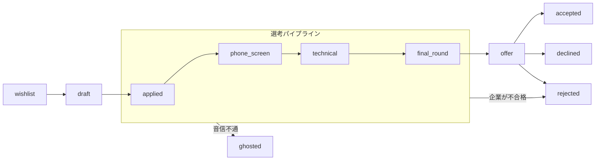

# KarirKalyan（キャリルカリャン）

[](https://github.com/chairulakmal/karirkalyan/actions/workflows/api.yml)
[](https://github.com/chairulakmal/karirkalyan/actions/workflows/web.yml)
[](LICENSE)

[🇬🇧 English](README.md)

Rails 8 API + Next.js 16 で構築した、フルスタックの就職活動管理アプリです。「どの企業に応募したか」「選考がどの段階にあるか」「いつフォローアップするか」を一元管理できます。

**ライブデモ：** [kk.chairulakmal.com](https://kk.chairulakmal.com) · **APIドキュメント：** [Swagger UI `/api-docs`](https://api-production-4899.up.railway.app/api-docs)

**デモアカウント** — `demo@karirkalyan.com` / `oretachinomachida` でログインすると、東京テック系企業への架空の就職活動データ（12件、全FSM状態カバー）を確認できます。サインインページの **「Try demo account」** ボタンからもアクセスできます。

---

## 技術的ハイライト

| 関心事 | アプローチ |
|---|---|
| 状態機械 | 自作PORO（gemなし）。`TRANSITIONS`配列を読めばすべての遷移が一目でわかる |
| 監査ログ | ステータス変更ごとに`TimelineEntry`をトランザクション内で書き込む |
| 認証 | Devise + devise-jwt（JTI失効による真のログアウト） |
| 並行制御 | 楽観的ロック（`lock_version`）→ 競合時は`409 Conflict` |
| バックグラウンドジョブ | Sidekiq + 冪等性キー（at-least-once配信に対応） |
| ファイル保存 | PostgreSQL `bytea`カラム、1MB上限、PDFマジックバイト検証 |
| ダッシュボード | 純粋SQL集計。N+1なし、Rubyへのレコードロードなし |
| APIドキュメント | rswag（リクエストスペックとOpenAPI仕様を共通化） |
| テスト | ユニットスペック（DB不要）＋リクエストスペック（実PostgreSQL） |
| ページネーション | カーソルベース（`?after=<base64_cursor>&limit=20`） |

---

## 有限状態機械（FSM）

FSMは [`app/lib/application_fsm.rb`](api/app/lib/application_fsm.rb) に実装されています。gemなし、Rubyモジュールと`TRANSITIONS`配列のみ。ファイルを開けば許可された遷移がすべて一目で確認できます。

状態モデルはGreenhouse・Lever・WorkdayなどのATSパイプラインに準拠し、Huntr・Tealのような個人向けトラッカーが追加する候補者側の状態（`wishlist`・`withdrawn`・`ghosted`）を加えています。



図では省略している遷移が2種類あります。非終端状態はすべて `withdrawn`（候補者の辞退）または `archived`（非表示化）へ遷移可能です。また `ghosted → applied` の遷移も存在します（企業から再連絡が来るケースに対応）。

### 状態一覧

| 状態 | 起点 | 意味 |
|---|---|---|
| `wishlist` | 候補者 | 気になる求人を保存した状態。まだ応募していない |
| `draft` | 候補者 | 応募準備中（履歴書・カバーレター作成中） |
| `applied` | 候補者 | 応募済み |
| `phone_screen` | 採用担当者 | 採用担当者によるスクリーニング面談（予定または完了） |
| `technical` | 採用担当者 | 技術面接（コーディングテスト・課題など） |
| `final_round` | 採用担当者 | 最終面接・オンサイト面接 |
| `offer` | 企業 | 内定通知 |
| `accepted` | 候補者 | 内定承諾 ― 終端状態 |
| `declined` | 候補者 | 内定辞退 ― 終端状態 |
| `rejected` | 企業 | 企業側が不採用を決定 ― 終端状態 |
| `ghosted` | ― | 一定期間後も連絡なし ― `applied` へ復活可能 |
| `withdrawn` | 候補者 | 候補者が選考途中で辞退 ― 終端状態 |
| `archived` | 候補者 | タイムライン履歴を残したまま通常ビューから非表示 ― 終端状態 |

**設計ノート：**
- `ghosted` は終端状態ではありません。企業から再連絡が来るケースがあるため、FSMは `ghosted → applied` の遷移を許容しています。
- `rejected`（企業側の不採用）、`declined`（候補者が内定辞退）、`withdrawn`（候補者が途中辞退）は意図的に区別しています。実際のATSパイプラインの設計に準拠したもので、これらをひとつの「クローズ」状態にまとめると、コホート分析で重要なシグナルが失われます。
- 非終端状態はすべて `archived` へ遷移可能。タイムライン履歴を削除せずに通常ビューから非表示にできます。

ステータス変更はすべて `Applications::TransitionService` を経由します。データベース操作の前に遷移の妥当性を検証し、ステータス更新と `TimelineEntry` の書き込みを単一トランザクションで実行します。`status` への直接代入はコードベース全体で使用されていません。

---

[Awano](https://github.com/chairulakmal/awano) もご参照ください。Next.js を用いたマルチテナント対応サポートデスクで、FSM・トランザクション監査ログ・サービス層・二層テスト戦略という同じ設計思想を別スタックで表現しています。

---

## コードベースツアー

レビュアー向けの90秒ガイドです。以下のファイルを順に読むと全体像が掴めます。

```
api/
  app/lib/application_fsm.rb              ← FSM：TRANSITIONSのみ、gemなし、上から読めば全遷移がわかる
  app/services/applications/
    transition_service.rb                 ← ステータス変更＋監査ログを単一トランザクションで実行
  app/jobs/follow_up_reminder_job.rb      ← 冪等性キーを持つSidekiqジョブ
  app/controllers/api/v1/
    applications_controller.rb            ← REST＋遷移＋バイナリファイルダウンロード
    dashboard_controller.rb               ← 純粋SQL集計。N+1なし、Rubyへのレコードロードなし
  app/models/
    application.rb                        ← FSM管理ステータス、byteaファイルカラム＋マジックバイト検証
    timeline_entry.rb                     ← 追記専用監査ログ
  spec/
    lib/, services/                       ← ユニットスペック（DB不要、高速）
    requests/                             ← 実DB使用のリクエストスペック（rswagのOpenAPI生成源）

web/
  proxy.ts                                ← 認証ルートガード（Next.js 16でmiddleware.tsをproxy.tsに改名）
  app/api/auth/session/route.ts           ← RailsからJWTを受け取り、httpOnly Cookieをセット
  app/lib/api.ts                          ← サーバーサイドfetchヘルパー（JWTはブラウザに届かない）
  app/(app)/dashboard/page.tsx            ← 求人一覧＋ダッシュボード統計
  app/(app)/applications/[id]/page.tsx    ← 詳細＋タイムライン＋FSM駆動の遷移ボタン
```

アーキテクチャの意思決定の詳細は [notes/PLAN.md](notes/PLAN.md) にあります。

---

## 何がどこにあるか

| 探しているもの | 参照先 |
|---|---|
| APIエンドポイントの仕様・パラメータ・レスポンス | [`/api-docs`](https://api-production-4899.up.railway.app/api-docs)（Swagger UI）または `api/swagger/v1/swagger.yaml` |
| アーキテクチャの意思決定・設計根拠 | [notes/PLAN.md](notes/PLAN.md) |
| ローカルセットアップ・テスト実行 | [api/README.md](api/README.md)、[web/README.md](web/README.md) |

---

## なぜ Rails API + Next.js の構成なのか

Rails はデータ整合性・バックグラウンドジョブ・APIサーバーとしての役割に特化しています。Next.js のAPI Route（サーバーサイド）を介してJWTを `httpOnly` Cookie に格納することで、XSSによるトークン漏洩を防いでいます。Viteのような純クライアントサイドバンドラーでは、安全なCookieを設定するサーバー層が別途必要になります。

また、Next.js はもう一つのポートフォリオプロジェクト [Awano](https://github.com/chairulakmal/awano)（マルチテナント対応サポートデスク）でも採用しています。採用担当者が両プロジェクトを見比べると、FSM・トランザクション監査ログ・サービス層・二層テスト戦略という同じ設計思想が、Rails と Next.js という異なるスタックで表現されていることを確認できます。

---

## 技術スタック

- **バックエンド：** Rails 8 API-only、Ruby 3.4.9、PostgreSQL 16、Devise + devise-jwt、Sidekiq
- **フロントエンド：** Next.js 16 App Router、Tailwind CSS
- **インフラ：** Docker Compose（ローカル）、Railway（本番）

---

## リポジトリ構成

```
api/   ← Rails 8 API
web/   ← Next.js 16 フロントエンド
```

詳細なセットアップ手順は [api/README.md](api/README.md) と [web/README.md](web/README.md) を参照してください。
