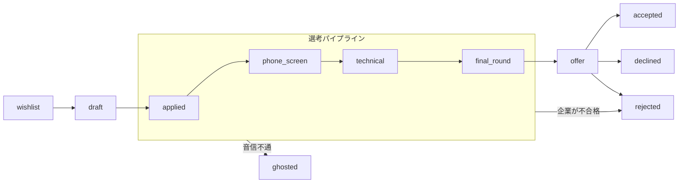

# KarirKalyan（キャリルカリャン）

[](https://github.com/chairulakmal/karirkalyan/actions/workflows/api.yml)
[](https://github.com/chairulakmal/karirkalyan/actions/workflows/web.yml)
[](LICENSE)

[🇬🇧 English](README.md)

Rails 8 API + Next.js 16 で構築した、フルスタックの就職活動管理アプリです。「どの企業に応募したか」「選考がどの段階にあるか」「いつフォローアップするか」を一元管理できます。

**ライブデモ：** [kk.chairulakmal.com](https://kk.chairulakmal.com) · **APIドキュメント：** [Swagger UI `/api-docs`](https://api-production-4899.up.railway.app/api-docs)

**デモアカウント** — [サインインページ](https://kk.chairulakmal.com/sign-in)の **「Try demo account」** ボタンをクリックすると、東京テック系企業への架空の就職活動データ（12件、全FSM状態カバー）を確認できます。手動でログインする場合は `demo@karirkalyan.com` / `oretachinomachida` をご利用ください。

---

## 技術的ハイライト

| 関心事 | アプローチ |
|---|---|
| 状態機械 | 自作PORO（gemなし）。`TRANSITIONS`配列を読めばすべての遷移が一目でわかる |
| 監査ログ | ステータス変更ごとに`TimelineEntry`をトランザクション内で書き込む |
| 認証 | Devise + devise-jwt（JTI失効による真のログアウト） |
| 並行制御 | 楽観的ロック（`lock_version`）→ 競合時は`409 Conflict` |
| バックグラウンドジョブ | Solid Queue（Postgresベース、Puma内で稼動 — 追加サービス不要）。冪等性キーパターン（at-least-once配信に対応） |
| メール送信 | ActionMailer + SMTP（Resend）。サインアップ時のウェルカムメールと、毎日8:15 JSTに送る**ダイジェスト**（Solid Queue定期タスク）。応募ごとに1通ではなく、1日1通にまとめる |
| カレンダー対応 | 土日・祝日・年末年始・ゴールデンウィーク・お盆はダイジェストを送らない — 正月に届くリマインダーは誰も読まない。送らなかった分は破棄せず**繰り延べ**、翌営業日に一度だけ届く |
| AI自動入力 | 求人URLを貼り付けると Claude Haiku 4.5 が企業名・職種・メモを抽出し、保存前に確認・編集できる。サーバーサイドのサービス層で実行、SSRF対策＋レート制限あり、日本語の求人もそのまま読み取る |
| キャッシュ | Solid Cache（Postgresベース）— Rack::Attackスロットルカウンターを全Pumaワーカーで共有。Redis不要 |
| ファイル保存 | PostgreSQL `bytea`カラム、1MB上限、PDFマジックバイト検証 |
| ダッシュボード | 純粋SQL集計。N+1なし、Rubyへのレコードロードなし |
| 音信不通の予測 | *利用者自身*の返信待ち日数の90パーセンタイルを超えて音沙汰のない応募を検出する。監査ログからウィンドウ関数で再構成するため、カラムもテーブルも追加しない。その段階での返信が5件に満たないうちは共通の初期値を使い、どちらを使ったかを画面上で明示する |
| カンバンボード | カードのドラッグがそのままFSM遷移になる。楽観的に反映し、`409`ならカードは元の列へ戻る。遷移テーブルはTypeScript側に写さず`GET /api/v1/transitions`から取得。各カードのメニューが遷移可能な状態をすべて列挙し、これがアクセシブルな経路 |
| データ書き出し | 2種類のダウンロード、目的も別。応募一覧のCSV（表計算ソフト向けの簡易版、数式インジェクション対策済み）と、アカウント全体の`.zip`（`account.json`＋アップロードした履歴書・職務経歴書一式）。後者は「読む」ためではなく「取り戻す」ためのもの |
| APIドキュメント | rswag（リクエストスペックとOpenAPI仕様を共通化） |
| テスト | ユニットスペック（DB不要）＋リクエストスペック（実PostgreSQL） |
| 多言語対応 | READMEを訳しただけではなく、プロダクト自体が英語・日本語の両方で動作する。next-intl＋ICUメッセージカタログを採用し、`ja`はプレフィックス付き・`en`はプレフィックスなしとすることで各ページのURLを1つに正規化。`hreflang`とサイトマップにも反映 |
| ページネーション | カーソルベース（`?after=<base64_cursor>&limit=20`） |

---

## 有限状態機械（FSM）

FSMは [`app/lib/application_fsm.rb`](api/app/lib/application_fsm.rb) に実装されています。gemなし、Rubyモジュールと`TRANSITIONS`配列のみ。ファイルを開けば許可された遷移がすべて一目で確認できます。

状態モデルはGreenhouse・Lever・WorkdayなどのATSパイプラインに準拠し、Huntr・Tealのような個人向けトラッカーが追加する候補者側の状態（`wishlist`・`withdrawn`・`ghosted`）を加えています。



図では省略している遷移が複数あります。非終端状態はすべて `withdrawn`（候補者の辞退）または `archived`（非表示化）へ遷移可能です。また `ghosted → applied`（企業からの再連絡）、`rejected → applied`・`withdrawn → applied`（ネガティブな結果後の再エンゲージメント）の遷移も存在します。

### 状態一覧

| 状態 | 起点 | 意味 |
|---|---|---|
| `wishlist` | 候補者 | 気になる求人を保存した状態。まだ応募していない |
| `draft` | 候補者 | 応募準備中（履歴書・カバーレター作成中） |
| `applied` | 候補者 | 応募済み |
| `phone_screen` | 採用担当者 | 採用担当者によるスクリーニング面談（予定または完了） |
| `technical` | 採用担当者 | 技術面接（コーディングテスト・課題など） |
| `final_round` | 採用担当者 | 最終面接・オンサイト面接 |
| `offer` | 企業 | 内定通知 |
| `accepted` | 候補者 | 内定承諾 ― 終端状態 |
| `declined` | 候補者 | 内定辞退 ― 終端状態 |
| `rejected` | 企業 | 企業側が不採用を決定 ― `applied` へ復活可能 |
| `ghosted` | ― | 一定期間後も連絡なし ― `applied` へ復活可能 |
| `withdrawn` | 候補者 | 候補者が選考途中で辞退 ― `applied` へ復活可能 |
| `archived` | 候補者 | タイムライン履歴を残したまま通常ビューから非表示 ― 終端状態 |

**設計ノート：**
- `rejected`・`ghosted`・`withdrawn` は終端状態ではありません。採用担当者が不採用を撤回するケース、企業がゴーストした候補者に再連絡するケース、候補者が辞退後に再エンゲージするケースに対応しています。すべての復活は `TimelineEntry` 監査ログに記録されるため、履歴は完全に保持されます。
- `accepted`・`declined`・`archived` のみが真の終端状態です。内定を一度承諾した後に「未承諾に戻す」ことはなく、候補者による内定辞退は意図的な最終決定であり、操作ミスではないためです。
- `rejected`（企業側の不採用）、`declined`（候補者が内定辞退）、`withdrawn`（候補者が途中辞退）は意図的に区別しています。実際のATSパイプラインの設計に準拠したもので、これらをひとつの「クローズ」状態にまとめると、コホート分析で重要なシグナルが失われます。
- 真の終端状態（`accepted`・`declined`・`archived`）以外はすべて `archived` へ遷移可能。タイムライン履歴を削除せずに通常ビューから非表示にできます。

ステータス変更はすべて `Applications::TransitionService` を経由します。データベース操作の前に遷移の妥当性を検証し、ステータス更新と `TimelineEntry` の書き込みを単一トランザクションで実行します。`status` への直接代入はコードベース全体で使用されていません。

**作成時の状態と遷移の違い。** FSMが管理するのは「変更（遷移）」であり、「作成」時には初期状態を設定します。ユーザーは実際の進捗段階で求人を追加するため、新規application はフォーム上で `wishlist`・`draft`・`applied` の3つのエントリ状態のいずれかから開始できます。`status` はマスアサインメント不可で、エントリ値は許可リストで検証されるため、作成時にいきなり後段の状態へ飛ぶことはできません。エントリ状態より先の段階は遷移によってのみ到達可能です。すでに応募済みの求人を追加する場合は、任意の応募日を指定して `applied_at` をさかのぼって設定でき、ダッシュボードの集計が正確に保たれます。

---

[Awano](https://github.com/chairulakmal/awano) もご参照ください。Next.js を用いたマルチテナント対応サポートデスクで、FSM・トランザクション監査ログ・サービス層・二層テスト戦略という同じ設計思想を別スタックで表現しています。

---

## 認証

Devise + devise-jwt によるJWT認証です。サインイン時にRailsが `Authorization` ヘッダーでJWTを発行し、Next.jsの `/api/auth/session` ルートがそれを受け取って `httpOnly` Cookieに格納します（[`web/app/api/auth/session/route.ts`](web/app/api/auth/session/route.ts)）— トークンがクライアントサイドJSに渡ることはありません。

- **ユーザーごとに単一セッション。** 失効戦略には devise-jwt の `JTIMatcher` を採用しており、トークンごとの許可リストではなく `users` テーブルの `jti` カラム1つで管理しています（[`api/app/models/user.rb`](api/app/models/user.rb)）。サインアウトするとJTIがローテーションされ、そのユーザーの発行済みトークンがすべて一括で失効します。デバイスごとのセッションという概念がないため、1台でサインアウトすると全デバイスでサインアウトされます。これは意図した挙動であり、バグではありません。
- **有効期限は1日、リフレッシュフローなし。** トークンは発行から `1.day` で失効します（`jwt.expiration_time`、[`api/config/initializers/devise.rb`](api/config/initializers/devise.rb)）。セッションCookieの `maxAge` もこれに合わせています。リフレッシュトークンのエンドポイントは存在しません — トークンが失効するとAPIは `401` を返し、フロントエンドはCookieを削除した上で `/api/auth/expired` 経由でサインインページへリダイレクトします（[`web/app/lib/api.ts`](web/app/lib/api.ts)）。再ログインする以外に復帰する手段はありません。

---

## コードベースツアー

レビュアー向けの90秒ガイドです。以下のファイルを順に読むと全体像が掴めます。

```
api/
  app/lib/application_fsm.rb              ← FSM：TRANSITIONSのみ、gemなし、上から読めば全遷移がわかる
  app/lib/japan_calendar.rb               ← 日本の営業日を判定する唯一の場所
  app/services/applications/
    transition_service.rb                 ← ステータス変更＋監査ログを単一トランザクションで実行
  app/services/exports/
    applications_csv.rb                   ← 表計算ソフト向けの簡易版。数式インジェクション対策済み
    account_archive.rb                    ← account.json＋アップロード済みPDF一式をメモリ上でzip化
  app/queries/applications/
    ghost_risk_query.rb                   ← 監査ログから各段階の滞留日数を再構成（ウィンドウ関数）
  app/jobs/follow_up_reminder_job.rb      ← 冪等性キーを持つ定期実行ジョブ
  app/controllers/api/v1/
    applications_controller.rb            ← REST＋遷移＋バイナリファイルダウンロード
    dashboard_controller.rb               ← 純粋SQL集計。N+1なし、Rubyへのレコードロードなし
    exports_controller.rb                 ← send_dataによる2つのエンドポイント。いずれもcurrent_userに限定
  app/models/
    application.rb                        ← FSM管理ステータス、byteaファイルカラム＋マジックバイト検証
    timeline_entry.rb                     ← 追記専用監査ログ
  spec/
    lib/, services/                       ← ユニットスペック（DB不要、高速）
    requests/                             ← 実DB使用のリクエストスペック（rswagのOpenAPI生成源）

web/
  proxy.ts                                ← 認証ルートガード（Next.js 16でmiddleware.tsをproxy.tsに改名）
  app/api/auth/session/route.ts           ← RailsからJWTを受け取り、httpOnly Cookieをセット
  app/lib/api.ts                          ← サーバーサイドfetchヘルパー（JWTはブラウザに届かない）
  i18n/navigation.ts                      ← ロケール対応のLink/router（next/linkではなくこちらを使う）
  app/[locale]/(app)/dashboard/page.tsx         ← 求人一覧＋ダッシュボード統計
  app/[locale]/(app)/applications/[id]/page.tsx ← 詳細＋タイムライン＋FSM駆動の遷移ボタン
  app/[locale]/(app)/board/board.tsx            ← カンバンボード。ドラッグ＝遷移、可否はAPIから取得
```

アーキテクチャの意思決定の詳細は、本プロジェクトの技術的な信頼できる唯一の情報源である
[SPEC.md](SPEC.md) にあります。

---

## ローカルでの起動方法

1つのリポジトリに2つのアプリが入っています：

```
api/   ← Rails 8 API              → :3001
web/   ← Next.js 16 フロントエンド   → :3000
```

**前提環境：** Docker、Ruby 3.4.9、Node 24

```bash
# 1. Postgres 18（起動するコンテナはこれだけ — Redis不要）
cd api && docker compose up -d

# 2. API を :3001 で起動
bundle install
bin/rails db:create db:migrate
bin/rails db:seed          # 任意 — デモアカウントとサンプル応募12件を投入
bin/rails server

# 3. フロントエンドを :3000 で起動（別ターミナル）
cd web && npm install && npm run dev
```

[localhost:3000](http://localhost:3000) を開いてください。開発環境ではバックグラウンドジョブは `:async` アダプタでインライン実行されるため、ワーカープロセスを別途起動する必要はありません。

環境変数・テスト・デモデータのリセットなど、詳細は [api/README.md](api/README.md) と [web/README.md](web/README.md) を参照してください。

---

## 何がどこにあるか

| 探しているもの | 参照先 |
|---|---|
| APIエンドポイントの仕様・パラメータ・レスポンス | [`/api-docs`](https://api-production-4899.up.railway.app/api-docs)（Swagger UI）または `api/swagger/v1/swagger.yaml` |
| アーキテクチャ・データモデル・API仕様・設計根拠 | [SPEC.md](SPEC.md) |
| リリースごとの実装済みの変更履歴 | [CHANGELOG.md](CHANGELOG.md) |
| 未着手のタスクとロードマップ | [TODO.md](TODO.md) |
| ローカルセットアップ・テスト実行 | [api/README.md](api/README.md)、[web/README.md](web/README.md) |

---

## なぜ Rails API + Next.js の構成なのか

Rails はデータ整合性・バックグラウンドジョブ・APIサーバーとしての役割に特化しています。Next.js のAPI Route（サーバーサイド）を介してJWTを `httpOnly` Cookie に格納することで、XSSによるトークン漏洩を防いでいます。Viteのような純クライアントサイドバンドラーでは、安全なCookieを設定するサーバー層が別途必要になります。

また、Next.js はもう一つのポートフォリオプロジェクト [Awano](https://github.com/chairulakmal/awano)（マルチテナント対応サポートデスク）でも採用しています。採用担当者が両プロジェクトを見比べると、FSM・トランザクション監査ログ・サービス層・二層テスト戦略という同じ設計思想が、Rails と Next.js という異なるスタックで表現されていることを確認できます。

---

## 技術スタック

- **バックエンド：** Rails 8 API-only、Ruby 3.4.9、PostgreSQL 18、Devise + devise-jwt
- **フロントエンド：** Next.js 16 App Router、Tailwind CSS
- **インフラ：** Docker Compose（ローカル）、Railway（本番）— マネージド PostgreSQL 18（ローカルとメジャーバージョンを統一）。Solid Queue + Solid Cache を同一Postgresで運用（Redis不要）
