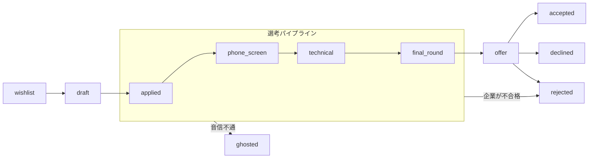

# KarirKalyan（キャリルカリャン）

[](https://github.com/chairulakmal/karirkalyan/actions/workflows/api.yml) [](https://github.com/chairulakmal/karirkalyan/actions/workflows/web.yml) [](LICENSE)

[🇬🇧 English](README.md)

Rails 8 API + Next.js 16 で構築した、フルスタックの就職活動管理アプリです。「どの企業に応募したか」「選考がどの段階にあるか」「いつフォローアップするか」を一元管理できます。作者である私自身が、実際の就職活動でこのアプリを使っています。機能はどれも、私自身が必要になったから作ったものです。これがこのプロジェクトの**北極星 — たった一人の忠実なユーザーである私自身にとって、最高のキャリアアプリであること**。ポートフォリオとしての価値はその結果としてついてくるものであって、逆ではありません — 実際に使われているツールと機能の見本市の違いは、レビュアーには伝わるものです。そしてプロダクト自体が英語・日本語の両方で動作します。

**ライブデモ：** [kk.chairulakmal.com](https://kk.chairulakmal.com) · **APIドキュメント：** [Swagger UI `/api-docs`](https://api-production-4899.up.railway.app/api-docs)

**デモアカウント** — [サインインページ](https://kk.chairulakmal.com/sign-in)の **「Try demo account」** ボタンをクリックすると、東京テック系企業への架空の就職活動データ（Marcari、Vine Corp、Rokuton ほか12件、全FSM状態カバー）を確認できます。手動でログインする場合は `demo@karirkalyan.com` / `oretachinomachida` をご利用ください。

**技術スタック** — Rails 8 API-only · Ruby 3.4.9 · PostgreSQL 18 · Devise + devise-jwt · Next.js 16 App Router · Tailwind CSS。ローカルは Docker Compose、本番は Railway（Postgres のメジャーバージョンを両環境で統一）。バックグラウンドジョブ（Solid Queue）、キャッシュ（Solid Cache）、アップロードファイル（`bytea`）をすべて1つのデータベースで担う — Redis もオブジェクトストレージも、別のワーカーサービスも不要です。

---

## 技術的ハイライト

### ドメインモデリング

- **状態機械は素のRubyモジュール** — [`application_fsm.rb`](api/app/lib/application_fsm.rb) は `TRANSITIONS` 配列を持つPORO。gemなし — ファイルを開けば、許可された遷移がすべて読めます。図と設計ノートは[下記](#有限状態機械fsm)。
- **トランザクション内の監査ログ** — ステータス変更はすべて `Applications::TransitionService` を経由し、ステータス更新と `TimelineEntry` の書き込みを単一トランザクションで実行。`status` への直接代入はコードベース全体で使用されていません。
- **楽観的ロック** — `lock_version` により、同時編集は静かな上書きではなく `409 Conflict` になります。
- **フロントエンドはFSMの規則を取得する。書き写さない** — 遷移表の唯一の出所は `ApplicationFSM` であり、UIが適用する規則は、遷移可能な手も、新規作成時に選べる状態も、ボードの列の構成も、どの状態が「取り消せない」かも、すべて `GET /api/v1/transitions` から取得します。`web/` 側に残る状態名は、表示と操作の手がかりに属するものです — `Status` 型、ラベルの辞書、ボードの列の**並び順**、どの操作に確認を挟むか。すべての遷移はサーバー側で遷移表に照らして検証されるため、これらが古びても、操作の見せ方を誤ることはあっても、遷移を承認してしまうことはありません。（トップページの状態遷移図は意図的な例外で、その旨をソース自身に明記しています。何からも読まれない図解であり、矢印が古びても「誤った描画」であって「誤った遷移」にはなりません。）カードのドラッグがそのまま実際のFSM遷移になり、楽観的に反映して `409` なら元の列へ戻ります。各カードのメニューが遷移可能な状態をすべて列挙するため、ドラッグ操作なしでもボードを使えます。

### Postgres 1台、Redisなし

- **バックグラウンドジョブ** — Solid Queue（Postgresベース）が Puma 内で稼動 — 追加サービス不要。定期実行ジョブは冪等性キーパターンを採用し、at-least-once 配信でも安全です。
- **キャッシュとレート制限** — Solid Cache が Rack::Attack を支え、スロットルカウンターを全Pumaワーカーで共有します。
- **ファイル保存** — 履歴書・カバーレターは PostgreSQL の `bytea` カラムに格納。1MB上限、PDFマジックバイト検証つき。加えて1アカウントあたり200件の上限があります。レート制限と件数上限は役割が違います — レート制限が抑えるのは「速さ」だけで、時間枠は必ずリセットされるため、保存量そのものに天井を課せるのは件数の上限だけです。
- **ダッシュボード** — 純粋SQL集計。N+1なし、Rubyへのレコードロードなし。
- **ページネーション** — カーソルベース（`?after=<base64_cursor>&limit=20`）。

### 私自身の就職活動のための機能

- **音信不通の予測** — *利用者自身*の返信待ち日数の90パーセンタイルを超えて音沙汰のない応募を検出します。90パーセンタイルは監査ログからウィンドウ関数で再構成するため、カラムもテーブルも追加しません。その段階での返信が5件に満たないうちは共通の初期値を使い、どちらを使ったかを画面上で明示します。
- **AI自動入力** — 求人URLを貼り付けると Claude Haiku 4.5 が企業名・職種・メモを抽出し、保存前に確認・編集できます。サーバーサイドのサービス層で実行、SSRF対策＋レート制限あり、日本語の求人もそのまま読み取ります。サイトが自動読み取りを拒否した場合や、求人ページの代わりにログイン画面が返ってきた場合は、本文を自分で貼り付ければ同じ抽出処理が動きます。失敗しうるのは取得の工程だけだからです。
- **カレンダー対応のメール** — 毎日8:15 JSTに送る、ユーザーごと1日1通の**ダイジェスト**。応募ごとに1通は送りません（ActionMailer + SMTP（Resend）、Solid Queue の定期タスクとして実行。ほかに送るのはアカウント作成時のウェルカムメールだけ）。土日・祝日・年末年始・ゴールデンウィーク・お盆はダイジェストを送りません。送らなかった分は破棄せず繰り延べ、翌営業日に一度だけ届きます。
- **2種類のデータ書き出し** — 応募一覧のCSV（表計算ソフト向けの簡易版、数式インジェクション対策済み）と、アカウント全体の`.zip`（`account.json`＋アップロードした履歴書・職務経歴書一式）。後者は「読む」ためではなく「取り戻す」ためのものです。
- **ダウンロードするPDFには応募内容がそのままファイル名に** — 個別にダウンロードしても、アーカイブを展開しても、`株式会社メルカリ-バックエンドエンジニア-0712-12-resume.pdf` の形で出てきます。命名は1つのメソッドに集約しているので、どちらの経路で取り出しても同じファイルは同じ名前になります。日本語の社名はローマ字に変換せず、そのまま残します — `parameterize` に通すと日本語の社名は空文字列になりますし、そもそもダウンロードのファイル名がASCIIである必要はありません。
- **READMEだけでなくプロダクトが二言語** — next-intl＋ICUメッセージカタログを採用し、`ja`はプレフィックス付き・`en`はプレフィックスなしとすることで各ページのURLを1つに正規化。`hreflang`とサイトマップにも反映しています。

### セキュリティと誠実さ

- **ブラウザに届かないJWT** — Devise + devise-jwt（JTI失効）によるステートレスなトークンと真のログアウト。トークンはNext.jsのルートハンドラーがセットする `httpOnly` Cookie に格納されます。詳細は[認証](#認証)。
- **新規登録は、あえて閉じている。** サインアップ画面は存在しません — このアプリは履歴書を預かるものであり、私は自分の履歴書のために作ったのであって、他人の個人情報の管理者になるためではないからです。上記のデモアカウントでサインインしてください。デモがそのまま製品版です。実アカウントは私がサーバー上で作成します（`bin/rails users:create`）。登録を閉じたことでパスワード再設定の経路も無くなったため、パスワードを忘れた場合は `bin/rails users:set_password` で再設定します — JWT の `jti` が更新され、そのユーザーは全端末からサインアウトされます。
- **事実だけを書いた法務ページ** — [`/privacy`](https://kk.chairulakmal.com/privacy) と [`/terms`](https://kk.chairulakmal.com/terms)（日英両対応）。ひな形の模倣ではなく、実装どおりの事実を書いています：委託先5社を実名で列挙、機能的クッキー2つ、アナリティクスなし。そして「自分で削除できるボタン」は約束しません — 存在しないからです。削除依頼は私へのメールで、私が `DELETE /api/v1/auth/account` を実行します。

### 検証

- **テストから生成されるAPIドキュメント** — rswag により、リクエストスペックとOpenAPI仕様が単一のソースを共有します。
- **二層テスト** — ユニットスペック（DB不要、高速）＋リクエストスペック（実PostgreSQL、DBモックなし）。
- **英日カタログの一致は、慣習ではなくCIの検査** — `npm run lint:i18n` が2つのメッセージカタログを突き合わせ、片方の言語にしか無いキーがあればビルドを落とします。検査でなければならない理由は、日本語のキーが欠けてもLintも型チェックもビルドも通ってしまうからです — 型の誤りではないので、どれも気づけません。英語へのフォールバックはありません。読み込むカタログは常に1つだけなので、next-intl はキーのパスをそのまま描画します。つまり日本語話者には、文章があるべき場所に `dashboard.yourData` という文字列が出ます。壊れ方は派手なのに、CIは通ってしまう — そこを塞ぐための検査です。

---

## 有限状態機械（FSM）

FSMは [`app/lib/application_fsm.rb`](api/app/lib/application_fsm.rb) に実装されています。gemなし、Rubyモジュールと`TRANSITIONS`配列のみ。ファイルを開けば許可された遷移がすべて一目で確認できます。

状態モデルはGreenhouse・Lever・WorkdayなどのATSパイプラインに準拠し、Huntr・Tealのような個人向けトラッカーが追加する候補者側の状態（`wishlist`・`withdrawn`・`ghosted`）を加えています。



図では省略している遷移が複数あります。非終端状態はすべて `withdrawn`（候補者の辞退）または `archived`（非表示化）へ遷移可能です。また `ghosted → applied`（企業からの再連絡）、`rejected → applied`・`withdrawn → applied`（ネガティブな結果後の再エンゲージメント）の遷移も存在します。

### 状態一覧

| 状態 | 起点 | 意味 |
|---|---|---|
| `wishlist` | 候補者 | 気になる求人を保存した状態。まだ応募していない |
| `draft` | 候補者 | 応募準備中（履歴書・カバーレター作成中） |
| `applied` | 候補者 | 応募済み |
| `phone_screen` | 採用担当者 | 採用担当者によるスクリーニング面談（予定または完了） |
| `technical` | 採用担当者 | 技術面接（コーディングテスト・課題など） |
| `final_round` | 採用担当者 | 最終面接・オンサイト面接 |
| `offer` | 企業 | 内定通知 |
| `accepted` | 候補者 | 内定承諾 ― 終端状態 |
| `declined` | 候補者 | 内定辞退 ― 終端状態 |
| `rejected` | 企業 | 企業側が不採用を決定 ― `applied` へ復活可能 |
| `ghosted` | ― | 一定期間後も連絡なし ― `applied` へ復活可能 |
| `withdrawn` | 候補者 | 候補者が選考途中で辞退 ― `applied` へ復活可能 |
| `archived` | 候補者 | タイムライン履歴を残したまま通常ビューから非表示 ― 終端状態 |

**設計ノート：**
- `rejected`・`ghosted`・`withdrawn` は終端状態ではありません。採用担当者が不採用を撤回するケース、企業がゴーストした候補者に再連絡するケース、候補者が辞退後に再エンゲージするケースに対応しています。すべての復活は `TimelineEntry` 監査ログに記録されるため、履歴は完全に保持されます。
- `accepted`・`declined`・`archived` のみが真の終端状態です。内定を一度承諾した後に「未承諾に戻す」ことはなく、候補者による内定辞退は意図的な最終決定であり、操作ミスではないためです。
- `rejected`（企業側の不採用）、`declined`（候補者が内定辞退）、`withdrawn`（候補者が途中辞退）は意図的に区別しています。実際のATSパイプラインの設計に準拠したもので、これらをひとつの「クローズ」状態にまとめると、コホート分析で重要なシグナルが失われます。
- 真の終端状態（`accepted`・`declined`・`archived`）以外はすべて `archived` へ遷移可能。タイムライン履歴を削除せずに通常ビューから非表示にできます。

ステータス変更はすべて `Applications::TransitionService` を経由します。データベース操作の前に遷移の妥当性を検証し、ステータス更新と `TimelineEntry` の書き込みを単一トランザクションで実行します。`status` への直接代入はコードベース全体で使用されていません。

**作成時の状態と遷移の違い。** FSMが管理するのは「変更（遷移）」であり、「作成」時には初期状態を設定します。ユーザーは実際の進捗段階で求人を追加するため、新規application はフォーム上で `wishlist`・`draft`・`applied` の3つのエントリ状態のいずれかから開始できます。`status` はマスアサインメント不可で、エントリ値は許可リストで検証されるため、作成時にいきなり後段の状態へ飛ぶことはできません。エントリ状態より先の段階は遷移によってのみ到達可能です。すでに応募済みの求人を追加する場合は、任意の応募日を指定して `applied_at` をさかのぼって設定でき、ダッシュボードの集計が正確に保たれます。

---

## 認証

Devise + devise-jwt によるJWT認証です。サインイン時にRailsが `Authorization` ヘッダーでJWTを発行し、Next.jsの `/api/auth/session` ルートがそれを受け取って `httpOnly` Cookieに格納します（[`web/app/api/auth/session/route.ts`](web/app/api/auth/session/route.ts)）— トークンがクライアントサイドJSに渡ることはありません。

- **ユーザーごとに単一セッション。** 失効戦略には devise-jwt の `JTIMatcher` を採用しており、トークンごとの許可リストではなく `users` テーブルの `jti` カラム1つで管理しています（[`api/app/models/user.rb`](api/app/models/user.rb)）。サインアウトするとJTIがローテーションされ、そのユーザーの発行済みトークンがすべて一括で失効します。デバイスごとのセッションという概念がないため、1台でサインアウトすると全デバイスでサインアウトされます。これは意図した挙動であり、バグではありません。
- **有効期限は1日、リフレッシュフローなし。** トークンは発行から `1.day` で失効します（`jwt.expiration_time`、[`api/config/initializers/devise.rb`](api/config/initializers/devise.rb)）。セッションCookieの `maxAge` もこれに合わせています。リフレッシュトークンのエンドポイントは存在しません — トークンが失効するとAPIは `401` を返し、フロントエンドはCookieを削除した上で `/api/auth/expired` 経由でサインインページへリダイレクトします（[`web/app/lib/api.ts`](web/app/lib/api.ts)）。再ログインする以外に復帰する手段はありません。

---

## コードベースツアー

レビュアー向けの90秒ガイドです。以下のファイルを順に読むと全体像が掴めます。

```
api/
  app/lib/application_fsm.rb              ← FSM：TRANSITIONSのみ、gemなし、上から読めば全遷移がわかる
  app/lib/japan_calendar.rb               ← 日本の営業日を判定する唯一の場所
  app/services/applications/
    transition_service.rb                 ← ステータス変更＋監査ログを単一トランザクションで実行
  app/services/exports/
    applications_csv.rb                   ← 表計算ソフト向けの簡易版。数式インジェクション対策済み
    account_archive.rb                    ← account.json＋アップロード済みPDF一式をメモリ上でzip化
  app/queries/applications/
    ghost_risk_query.rb                   ← 監査ログから各段階の滞留日数を再構成（ウィンドウ関数）
  app/jobs/follow_up_reminder_job.rb      ← 冪等性キーを持つ定期実行ジョブ
  app/controllers/api/v1/
    applications_controller.rb            ← REST＋遷移＋バイナリファイルダウンロード
    dashboard_controller.rb               ← 純粋SQL集計。N+1なし、Rubyへのレコードロードなし
    exports_controller.rb                 ← send_dataによる2つのエンドポイント。いずれもcurrent_userに限定
  app/models/
    application.rb                        ← FSM管理ステータス、byteaファイルカラム＋マジックバイト検証
    timeline_entry.rb                     ← 追記専用監査ログ
  spec/
    lib/, services/                       ← ユニットスペック（DB不要、高速）
    requests/                             ← 実DB使用のリクエストスペック（rswagのOpenAPI生成源）

web/
  proxy.ts                                ← 認証ルートガード（Next.js 16でmiddleware.tsをproxy.tsに改名）
  app/api/auth/session/route.ts           ← RailsからJWTを受け取り、httpOnly Cookieをセット
  app/lib/api.ts                          ← サーバーサイドfetchヘルパー（JWTはブラウザに届かない）
  i18n/navigation.ts                      ← ロケール対応のLink/router（next/linkではなくこちらを使う）
  app/[locale]/(app)/dashboard/page.tsx         ← 求人一覧＋ダッシュボード統計
  app/[locale]/(app)/applications/[id]/page.tsx ← 詳細＋タイムライン＋FSM駆動の遷移ボタン
  app/[locale]/(app)/board/board.tsx            ← カンバンボード。ドラッグ＝遷移、可否はAPIから取得
```

アーキテクチャの意思決定の詳細は、本プロジェクトの技術的な信頼できる唯一の情報源である[SPEC.md](SPEC.md) にあります。

---

## ローカルでの起動方法

1つのリポジトリに2つのアプリが入っています：

```
api/   ← Rails 8 API              → :3001
web/   ← Next.js 16 フロントエンド   → :3000
```

**前提環境：** Docker、Ruby 3.4.9、Node 24

```bash
# 1. Postgres 18（起動するコンテナはこれだけ — Redis不要）
cd api && docker compose up -d

# 2. API を :3001 で起動
bundle install
bin/rails db:create db:migrate
bin/rails db:seed          # 必須 — デモアカウント（とサンプル応募12件）を作成。
                           # 新規登録は閉じているため、ログイン手段はこれ。
                           # 運用者は `bin/rails users:create` でも作成できる。
bin/rails server

# 3. フロントエンドを :3000 で起動（別ターミナル）
cd web && npm install && npm run dev
```

[localhost:3000](http://localhost:3000) を開いてください。開発環境ではバックグラウンドジョブは `:async` アダプタでインライン実行されるため、ワーカープロセスを別途起動する必要はありません。

環境変数・テスト・デモデータのリセットなど、詳細は [api/README.md](api/README.md) と [web/README.md](web/README.md) を参照してください。

---

## 何がどこにあるか

| 探しているもの | 参照先 |
|---|---|
| APIエンドポイントの仕様・パラメータ・レスポンス | [`/api-docs`](https://api-production-4899.up.railway.app/api-docs)（Swagger UI）または `api/swagger/v1/swagger.yaml` |
| アーキテクチャ・データモデル・API仕様・設計根拠 | [SPEC.md](SPEC.md) |
| リリースごとの実装済みの変更履歴 | [CHANGELOG.md](CHANGELOG.md) |
| 未着手のタスクとロードマップ | [TODO.md](TODO.md) |
| ローカルセットアップ・テスト実行 | [api/README.md](api/README.md)、[web/README.md](web/README.md) |

---

## なぜ Rails API + Next.js の構成なのか

Rails はデータ整合性・バックグラウンドジョブ・APIサーバーとしての役割に特化しています。その前段に Next.js を置くことで、Viteのような純クライアントサイドバンドラーには無いもの — サーバー — が手に入ります。JWTはNext.jsのルートハンドラーで交換されて `httpOnly` Cookie に格納されるため、クライアントサイドJavaScriptには一切触れず、XSSバグがあってもトークンを盗み出せません。サーバー層が無ければ、このCookieを設定するためだけに結局サーバーを別途構築することになります。

また、Next.js は私のもう一つのポートフォリオプロジェクト [Awano](https://github.com/chairulakmal/awano)（マルチテナント対応サポートデスク）でも採用しています。両プロジェクトを見比べると、FSM・トランザクション監査ログ・サービス層・二層テスト戦略という同じ設計思想が、Rails と Next.js という異なるスタックで表現されていることを確認できます。
