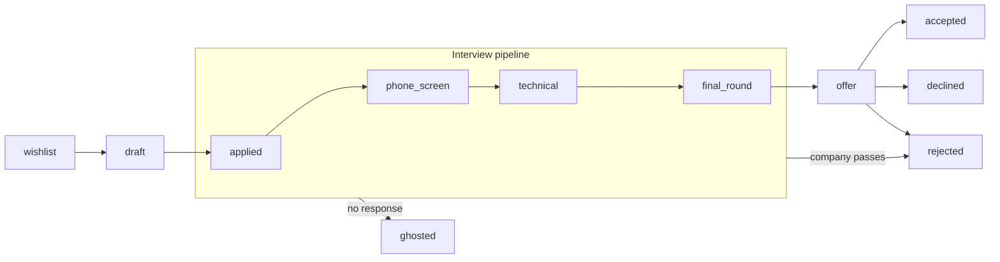

# KarirKalyan

[](https://github.com/chairulakmal/karirkalyan/actions/workflows/api.yml)
[](https://github.com/chairulakmal/karirkalyan/actions/workflows/web.yml)
[](LICENSE)

[🇯🇵 日本語](README.ja.md)

A full-stack job application tracker — Rails 8 API + Next.js 16 frontend.

**Live:** [kk.chairulakmal.com](https://kk.chairulakmal.com) · **API docs:** Swagger UI at [`/api-docs`](https://api-production-4899.up.railway.app/api-docs) on the API service

**Demo account** — sign in as `demo@karirkalyan.com` / `oretachinomachida` to explore a prefilled Tokyo tech job search (12 mock applications across Marcari, Vine Corp, Rokuton, and more — all FSM states covered). Or click **Try demo account** on the sign-in page.

---

## Technical highlights

| Concern | Approach |
|---|---|
| State machine | Custom PORO — no gem; transitions are a plain array, easy to audit |
| Audit trail | `TimelineEntry` written atomically with every status change |
| Auth | Devise + devise-jwt with JTI revocation — stateless JWT with real logout |
| Concurrency | Optimistic locking (`lock_version`) → `409 Conflict` |
| Background jobs | Sidekiq + idempotency key (at-least-once safe); runs in a dedicated `sidekiq` service in production |
| Email | ActionMailer over SMTP (Resend) — welcome email on sign-up + daily follow-up reminders scheduled via sidekiq-cron, delivered with `deliver_later` |
| AI pre-fill | Paste a job URL → Claude Haiku 4.5 extracts company/role/notes for review before saving; server-side service, SSRF-guarded + rate-limited, reads Japanese postings natively |
| Caching | Redis-backed `Rails.cache` in production — self-invalidating dashboard query cache + shared Rack::Attack throttle store |
| File storage | PostgreSQL `bytea`, 1 MB cap, PDF magic-byte validation |
| Dashboard | Pure SQL aggregation — no N+1, no records loaded into Ruby |
| API docs | rswag — request specs and OpenAPI spec share one source |
| Testing | Unit specs (no DB) + request specs (real PostgreSQL) |

---

## Finite State Machine

The FSM lives in [`app/lib/application_fsm.rb`](api/app/lib/application_fsm.rb) — a plain Ruby module with a `TRANSITIONS` array. No gem. Open the file and you can read every allowed transition in one pass.

The state model follows industry-standard ATS pipelines (Greenhouse, Lever, Workday) for the recruiter-driven stages, combined with the candidate-side states (`wishlist`, `withdrawn`, `ghosted`) that personal trackers like Huntr and Teal add on top.



Several transitions are omitted from the diagram to keep it readable: any non-terminal state can also move to `withdrawn` (candidate exits early) or `archived` (housekeeping); `ghosted → applied` covers the company reaching back out; and `rejected → applied` / `withdrawn → applied` cover re-engagement after a negative outcome.

### States

| State | Owner | Meaning |
|---|---|---|
| `wishlist` | candidate | Saved role of interest — not yet applied |
| `draft` | candidate | Application in progress (resume/cover letter being prepared) |
| `applied` | candidate | Application submitted |
| `phone_screen` | recruiter | Recruiter screen scheduled or completed |
| `technical` | recruiter | Technical interview (coding, take-home, etc.) |
| `final_round` | recruiter | Onsite / final-round interview |
| `offer` | company | Offer extended |
| `accepted` | candidate | Offer accepted — terminal |
| `declined` | candidate | Offer received but declined — terminal |
| `rejected` | company | Company declined the candidate — revivable to `applied` |
| `ghosted` | — | No response after a reasonable window — revivable to `applied` |
| `withdrawn` | candidate | Candidate withdrew before any decision — revivable to `applied` |
| `archived` | candidate | Hidden from default views without losing history — terminal |

**Design notes:**
- `rejected`, `ghosted`, and `withdrawn` are not hard terminal — each can transition back to `applied`. Recruiters rescind rejections; companies reach back out to ghosted candidates; candidates re-engage after withdrawing. Every reversal is logged in the `TimelineEntry` audit trail, so the history stays intact.
- Only `accepted`, `declined`, and `archived` are hard terminal. You don't un-accept a job offer, and a candidate declining an offer is a deliberate final outcome, not a mistake.
- `rejected` (company-initiated), `declined` (candidate refuses offer), and `withdrawn` (candidate exits early) are kept distinct. Collapsing them into one "closed" state loses the signal a recruiter looks for in cohort analytics.
- Any non-hard-terminal state can move to `archived` for housekeeping without deleting timeline history.

Status changes go through `Applications::TransitionService`, which asserts the transition before touching the database, then writes the status update and a `TimelineEntry` in a single transaction. Direct attribute writes to `status` are not used anywhere.

---

Also see [Awano](https://github.com/chairulakmal/awano) — a Next.js multi-tenant support desk using the same patterns (FSM, transactional audit trail, service layer, two-tier testing) in a different stack.

---

## Codebase tour

A 90-second walkthrough for reviewers landing cold. Read these files in order and you'll have the whole picture.

```
api/
  app/lib/application_fsm.rb              ← FSM: a TRANSITIONS array, no gem, read top to bottom
  app/services/applications/
    transition_service.rb                 ← Status change + audit row in one DB transaction
  app/jobs/follow_up_reminder_job.rb      ← Idempotent Sidekiq job (idempotency_key pattern)
  app/controllers/api/v1/
    applications_controller.rb            ← REST + transition + binary file download
    dashboard_controller.rb               ← Pure SQL aggregation — no N+1, no records loaded
  app/models/
    application.rb                        ← FSM-controlled status, bytea file columns + magic-byte validation
    timeline_entry.rb                     ← Append-only audit log
  spec/
    lib/, services/                       ← Unit specs — no DB, fast
    requests/                             ← Real-DB specs — also the rswag source for OpenAPI

web/
  proxy.ts                                ← Auth route guard (Next.js 16 renamed middleware.ts)
  app/api/auth/session/route.ts           ← Receives JWT from Rails, sets httpOnly cookie
  app/lib/api.ts                          ← Server-side fetch helper — JWT never reaches the browser
  app/(app)/dashboard/page.tsx            ← Applications list + stats
  app/(app)/applications/[id]/page.tsx    ← Detail + timeline + FSM-driven transition buttons
```

Architecture rationale for every decision lives in [PLAN.md](PLAN.md).

---

## Where to find what

| Looking for | Go to |
|---|---|
| API endpoint shapes, params, responses | [`/api-docs`](https://api-production-4899.up.railway.app/api-docs) (Swagger UI) or `api/swagger/v1/swagger.yaml` |
| Architecture decisions and design rationale | [PLAN.md](PLAN.md) |
| Local setup and running tests | [api/README.md](api/README.md), [web/README.md](web/README.md) |

---

## Stack

- **Backend:** Rails 8 API-only, Ruby 3.4.9, PostgreSQL 16, Devise + devise-jwt, Sidekiq
- **Frontend:** Next.js 16 App Router, Tailwind CSS
- **Infra:** Docker Compose (local); Railway (production) — separate `api` (Puma) and `sidekiq` (worker) services, managed PostgreSQL + Redis

---

## Repo layout

```
api/   ← Rails 8 API
web/   ← Next.js 16 frontend
```

See [api/README.md](api/README.md) and [web/README.md](web/README.md) for setup instructions.
