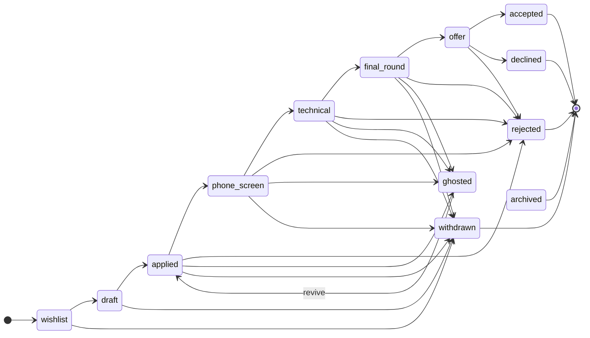

# KarirKalyan

A full-stack job application tracker — Rails 8 API + Next.js 16 frontend.

**Live:** [kk.chairulakmal.com](https://kk.chairulakmal.com) *(deploying soon)* · **API docs:** `/api-docs`

---

## Technical highlights

| Concern | Approach |
|---|---|
| State machine | Custom PORO — no gem; transitions are a plain array, easy to audit |
| Audit trail | `TimelineEntry` written atomically with every status change |
| Auth | Devise + devise-jwt with JTI revocation — stateless JWT with real logout |
| Concurrency | Optimistic locking (`lock_version`) → `409 Conflict` |
| Background jobs | Sidekiq + idempotency key (at-least-once safe) |
| File storage | PostgreSQL `bytea`, 1 MB cap, PDF magic-byte validation |
| Dashboard | Pure SQL aggregation — no N+1, no records loaded into Ruby |
| API docs | rswag — request specs and OpenAPI spec share one source |
| Testing | Unit specs (no DB) + request specs (real PostgreSQL) |

---

## State machine

The FSM lives in [`app/lib/application_fsm.rb`](api/app/lib/application_fsm.rb) — a plain Ruby module with a `TRANSITIONS` array. No gem. Open the file and you can read every allowed transition in one pass.

The state model follows industry-standard ATS pipelines (Greenhouse, Lever, Workday) for the recruiter-driven stages, combined with the candidate-side states (`wishlist`, `withdrawn`, `ghosted`) that personal trackers like Huntr and Teal add on top.



### States

| State | Owner | Meaning |
|---|---|---|
| `wishlist` | candidate | Saved role of interest — not yet applied |
| `draft` | candidate | Application in progress (resume/cover letter being prepared) |
| `applied` | candidate | Application submitted |
| `phone_screen` | recruiter | Recruiter screen scheduled or completed |
| `technical` | recruiter | Technical interview (coding, take-home, etc.) |
| `final_round` | recruiter | Onsite / final-round interview |
| `offer` | company | Offer extended |
| `accepted` | candidate | Offer accepted — terminal |
| `declined` | candidate | Offer received but declined — terminal |
| `rejected` | company | Company declined the candidate — terminal |
| `ghosted` | — | No response after a reasonable window — revivable to `applied` |
| `withdrawn` | candidate | Candidate withdrew before any decision — terminal |
| `archived` | candidate | Hidden from default views without losing history — terminal |

**Design notes:**
- `ghosted` is not terminal — companies do reach back out, so the FSM allows `ghosted → applied`.
- `rejected` (company-initiated), `declined` (candidate refuses offer), and `withdrawn` (candidate exits early) are kept distinct. This matches how real ATS pipelines model outcomes — collapsing them into one "closed" state loses the signal a recruiter looks for in cohort analytics.
- Any non-terminal state can move to `archived` for housekeeping without deleting timeline history.

Status changes go through `Applications::TransitionService`, which asserts the transition before touching the database, then writes the status update and a `TimelineEntry` in a single transaction. Direct attribute writes to `status` are not used anywhere.

---

Also see [Awano](https://github.com/chairulakmal/awano) — a Next.js multi-tenant support desk using the same patterns (FSM, transactional audit trail, service layer, two-tier testing) in a different stack.

---

## Where to find what

| Looking for | Go to |
|---|---|
| API endpoint shapes, params, responses | `/api-docs` (Swagger UI) or `api/swagger/v1/swagger.yaml` |
| Architecture decisions and design rationale | [notes/PLAN.md](notes/PLAN.md) |
| Local setup and running tests | [api/README.md](api/README.md), [web/README.md](web/README.md) |

---

## Stack

- **Backend:** Rails 8 API-only, Ruby 3.4.9, PostgreSQL 16, Devise + devise-jwt, Sidekiq
- **Frontend:** Next.js 16 App Router, Tailwind CSS
- **Infra:** Docker Compose (local), Railway (production)

---

## Repo layout

```
api/   ← Rails 8 API
web/   ← Next.js 16 frontend
```

See [api/README.md](api/README.md) and [web/README.md](web/README.md) for setup instructions.
